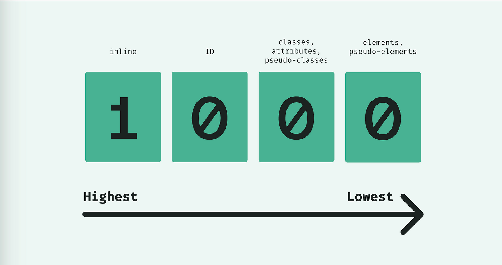

  

# CSS

Q. What is CSS ?

- CSS stands for Cascading Style Sheets.
- It is used to style html document.

Q. What is the difference between inline, internal, and external CSS ?

- Inline CSS is applied directly to an HTML element using the `style` attribute.
- Internal CSS is defined within the `<style>` tags in the `<head>` section of an HTML document.
- External CSS is stored in a separate CSS file and linked to the HTML document using the `<link>` tag.

Q. Type of selector in css ?

- We can divide CSS selectors into five categories:
    - Simple selectors (elements , id, class, *, group(,) )
    - [Combinator selectors](https://www.w3schools.com/css/css_combinators.asp) (descendant(space), direct child(>), adjacent sibling(+), general sibling(~) selector )
    - [Pseudo-class selectors](https://www.w3schools.com/css/css_pseudo_classes.asp) (select elements based on a certain state) (:link, :visited, :hover, :active, :first-child, :last-child, :foucs)
    - [Pseudo-elements selector](https://www.w3schools.com/css/css_pseudo_elements.asp) (select and style a part of an element) (::first-line, ::first-letter, ::before, ::after, ::marker, ::selection)
    - [Attribute selectors](https://www.w3schools.com/css/css_attribute_selectors.asp) (select elements based on an attribute or attribute value) ( [attribute="value"] ).

Q. What is different types of pseudo class selector ?

Q. What is different types of pseudo element selector ?

Q. What is box model in CSS ?

- All HTML elements can be considered as boxes.
- It consists of content, padding, border, and margin. The total width of an element is calculated as `width + padding + border + margin`.

Q. How do you center an element horizontally in CSS ?

- To center an element horizontally, set its `margin-left` and `margin-right` to `auto`.
- You may need to apply appropriate sizing and positioning to the parent container.

Q. What is the difference between `display: block`, `display: inline`, and `display: inline-block` ?

- Elements with `display: block` take up the full width of their parent and start on a new line.
- Elements with `display: inline` only take up the necessary space and do not force a line break.
- Elements with `display: inline-block` are similar to `inline` but allow setting height, width, padding, and margins.

Q. What is the `box-sizing` property in CSS ?

- The `box-sizing` property determines how the width and height of an element are calculated.
- By default, it is set to `content-box`, which includes only the content area.
- Setting it to `border-box` includes padding and border in the width and height calculations.

Q. What is a CSS pseudo-class ?

- A CSS pseudo-class is used to select and style elements `based on specific states` or conditions.
- Examples include `:hover`, `:active`, `:focus`, `:first-child`, `:nth-child`, etc.

Q. What is the difference between `margin` and `padding` ?

- `Margin` creates space outside the element, affecting the spacing between elements.
- `Padding` creates space within the element, affecting the spacing between the content and the border.

Q. How do you apply CSS styles to only specific browsers ?

- CSS vendor `prefixes` can be used to target specific browsers or versions.
- For example, `webkit-` for WebKit-based browsers (Chrome, Safari), `moz-` for Mozilla Firefox, and `ms-` for Microsoft Internet Explorer or Microsoft Edge.

Q. Can negative values be allowed in padding property?

- Padding No, Margin Yes

Q. Which CSS property is used to create an image reflection?

- `box-reflect`

Q. What function is used to insert values of a CSS variable?

- `var(--name, [value])`

Q. Which of the following CSS property creates a clipping region and specifies the visible area of the element?

- `clip-path`

Q. What if there are two or more CSS rules that point to the same element ?

- If there are two or more CSS rules that point to the same element, the selector with the highest specificity value will "win", and its style declaration will be applied to that HTML element.
- `inline > internal = external > default`

