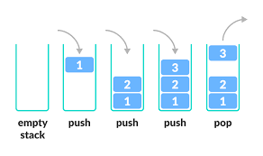

# Stack

- Stack is a linear data structure that provides last in first out (LIFO) insertion or remmoval of element.
- One way to implement the stack is to have a data structure where an array is used to store the elements in the stack.
- Variable called `top` keeps the location of topmost element in the stack (array).
  




# Stack Operations

Basic Stack Operations includes...

- push `O(1)`
- pop `O(1)`
- peek `O(1)`
- isEmpty (underflow) `O(1)`
- isFull (overflow) `O(1)`
- size `O(1)`

Note:

- While performing pop operation check if stack is already empty or not.

# Implementation

```Java
import java.util.*;

class Stack<T> {
    private Vector<T> items;

    public Stack() {
        items = new Vector<T>();
    }

    public void display() {
        System.out.println(items);
    }

    public void push(T element) {
        items.add(element);
    }

    public boolean isEmpty() {
        return items.size() == 0;
    }

    public T pop() {
        if (isEmpty())
            return null;
        int lastIndex = items.size() - 1;
        return items.remove(lastIndex);

    }

    public T peek() {
        if (isEmpty())
            return null;
        int lastIndex = items.size() - 1;
        return items.get(lastIndex);
    }

    public int size() {
        return items.size();
    }
}
```

# Application of Stack

- Polish Expressions and their compilation.
- Decimal to Binary conversation
- Tower of Hanoi
- Recursion (Recursion internally uses stack as data structure to store function's PCB).

### Infix, Postfix, Prefix

- Infix, Postfix, Prefix notations are three different but equivalent notations of writing algebraic expressions.
- Stacks are primarily used to convert an expression from one form to another and to evaluate those expressions.
- Prefix is parenthesis free notation (<u>Polish Notation</u>)
- Postfix is reverse of parenthesis free prefix notation (<u>Reverse Polish Notation</u>)
1. Infix
	- Within Infix notation, operator is used between two operands.
	- Example: A + B
2. Postfix
	- As the name suggests, operator is always placed after operands.

- Example:

```Java
Example:
Infix: A + B
Postfix: AB+

Example:
Infix: (A + B) * C
Postfix: (AB+)C*
		 AB+C*
```

3. Prefix
	- As the name suggests, operator is always placed before operands.

- Example:

```Java
Example:
Infix  : A + B
Postfix: +AB

Example:
Infix  : (A + B) * C
Postfix: *(+AB)C
		 *+ABC
```


### 1. Infix to Postfix conversion using Stack

### 2. Evaluation of Postfix using Stack

### 3. Infix to Prefix conversion using Stack

### 4. Evaluation of Prefix using Stack

### Decimal to Binary conversation

### Tower of hanoi

- The Tower of Hanoi is a mathematical game or puzzle.
- It consists of three rods and a number of disks of different sizes, which can slide onto any rod.
- The puzzle starts with the disks in a neat stack in ascending order of size on one rod, the smallest at the top, thus making a conical shape.


- The objective of the puzzle is to move the entire stack to another rod, obeying the following simple rules:
    - Only one disk can be moved at a time.
    - Each move consists of taking the upper disk from one of the stacks and placing it on top of another stack or on an empty rod.
    - No larger disk may be placed on top of a smaller disk.