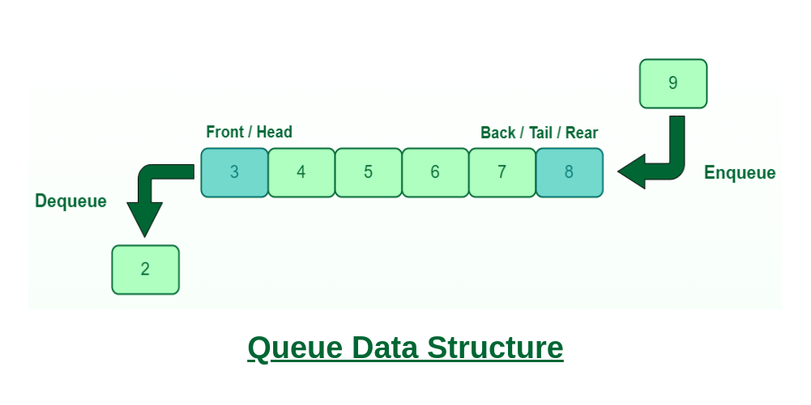

# Queue

- A queue is a linear data structure that follows the First-In-First-Out (LIFO) principle, This means that the first element added to the queue is the first element to be removed from the queue.
- One way to implement the queue is to have a data structure where an array is used to store the elements in the queue.
- And variables called front and rear keeps the location of corresponding element in the queue (array).




## Queue Operations

Basic Queue Operations includes...

- enqueue `O(1)`
- dequeue `O(1)`
- isEmpty (underflow) `O(1)`
- isFull (overflow) `O(1)`
- size `O(1)`

## Implementation

```Java
import java.util.*;

class Queue<T> {
    Vector<T> items;

    public Queue() {
        items = new Vector<T>();
    }

    public void display() {
        System.out.println(items);
    }

    public void enqueue(T element) {
        items.add(element);
    }

    public T dequeue() {
        if (isEmpty())
            return null;
        return items.remove(0);
    }

    public boolean isEmpty() {
        return items.size() == 0;
    }
    public int size() {
        return items.size();
    }
}
```

## Applications of Queue

- Widely used as waiting lists for single shared resource like printer, disk, CPU.
- Queues are used as buffers on MP3 players and portable CD players.
- Computer systems must often provide a “holding area” for messages between two processes, two programs, or even two systems. This holding area is usually called a “buffer” and is often implemented as a queue.

# Circular Queue

- The main difference between a circular queue and a regular queue is that a circular queue can reuse the space that is created when elements are deleted.
- This makes circular queues more efficient in terms of memory usage.
  


# Double-Ended Queue

- Double-Ended Queue is a data structure in which elements may be added to or deleted from the front or the rear.
- This differs from the QUEUE (FIFO), where elements can only be added to one end and removed from the other.


# Priority Queue

- A priority queue is an abstract data type which is like a regular queue data structure, but where additionally each element has a "priority" associated with it.
- It is like the “normal” queue except that the dequeuing elements follow a priority order. The priority order dequeues those items first that have the highest priority.


- It is possible that element ‘E’ may be deleted before an element pointed out by FRONT.
- Note: In competitive programming, a common data structure used to implement a priority queue is the Min-Heap.
- Rules:
  
    1. In a priority queue, an element with high priority is served before an element with low priority.
    2. If two elements have the same priority, they are served according to their order in the queue.