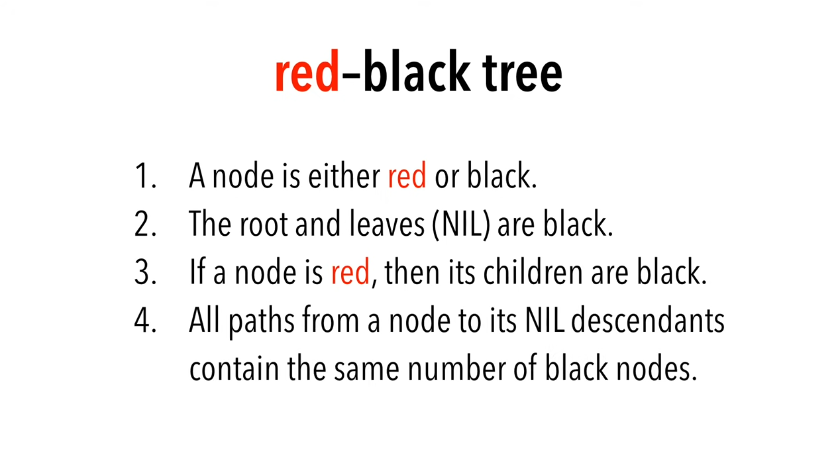
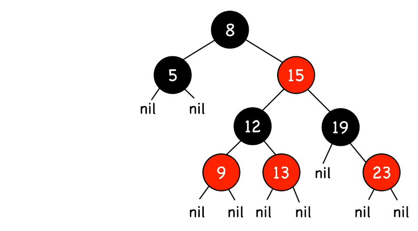
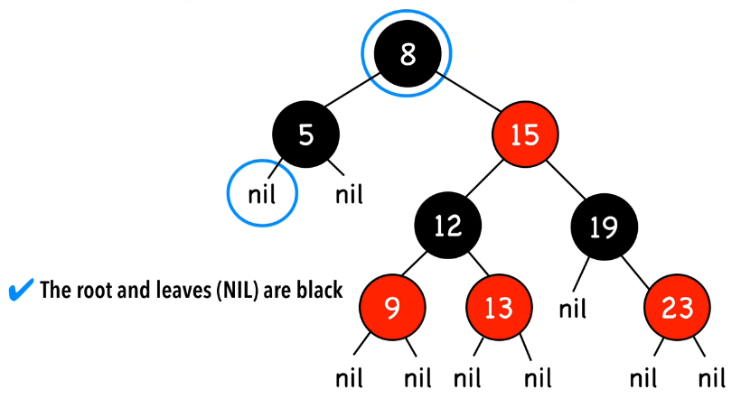
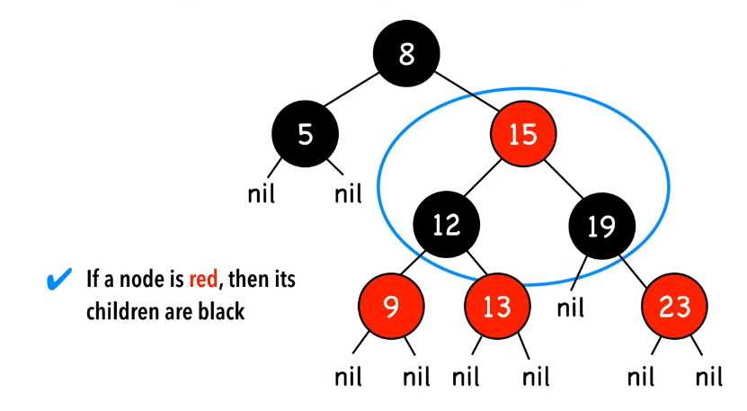
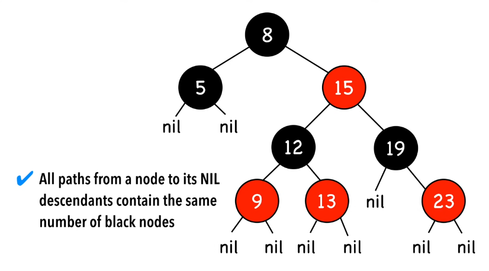
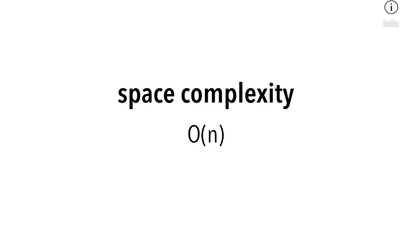
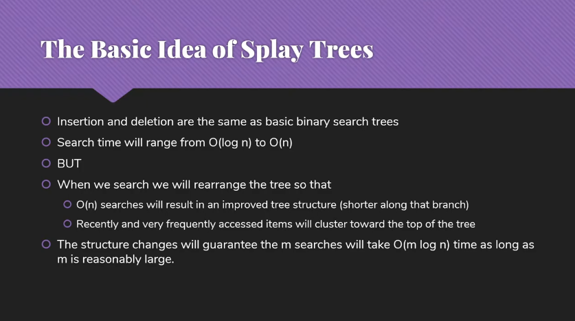
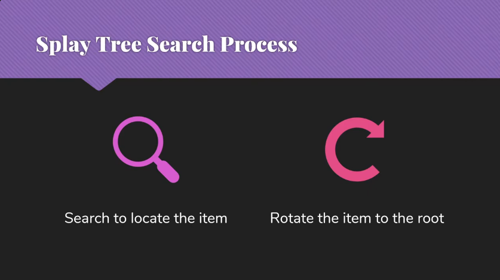
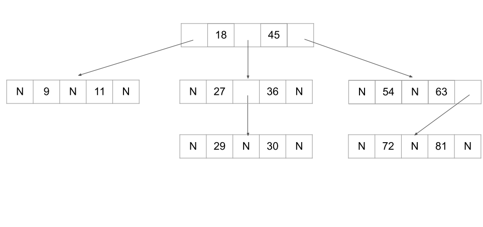
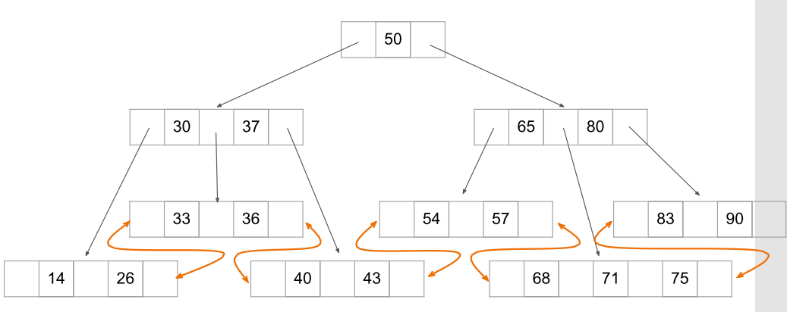

# Type of Tree

- Binary Tree (Strict | Complete | Full)
- General Tree
- Threaded Binary Tree
- XOR Tree
- Binary Search Tree
- Balanced Tree (Height / Weight)
    - AVL Tree
    - Red & Black
    - Splay Tree
    - Huffman (W.B.)
- M Way Search Tree
    - B Tree
    - B+ Tree
- Other Tree
    - Splay Tree
    - Augmented Tree
    - Scapegoat Tree
    - Interval Tree
- Heap


# Binary Tree

## Array Representation of Binary Tree

- In array representation of a binary tree, we use a one-dimensional array to represent a binary tree.
- If K is the parent, then (Consider K as root node)

```Plain
Left child = 2K
Right child = 2K+1
```

- Example:
  
```Plain
K=1
Left child = 2
Right Child = 3
```


## Linked List Representation of binary tree

- In a linked list representation of a binary tree, each node in the tree is represented by a linked list node.
- The linked list node has three fields: a pointer to the left child of the node, a pointer to the right child of the node, and a pointer to the data stored in the node.


## Construction of Tree from Travarsal

Example:

```Java
preOrder = {10,5,2,6,14,12,15};
inOrder = {2,5,6,10,12,14,15};
```

- First element in preorder[] will be the root of the tree, here its 10.
- Now the search element 10 in inorder[], say you find it at position i.
- Once you find it, make note of elements which are left to i (this will construct the leftsubtree) and elements which are right to i (this will construct the rightSubtree).
- See this step above and recursively construct left subtree and link it root.left and recursively construct right subtree and link it root.right.


## Implementation

```Java
class Node<T> {
    T data;
    Node<T> left;
    Node<T> right;
    
    Node(T data) {
        this.data = data;
        this.left = null;
        this.right = null;
    }
}

class Tree<T> {
    Node<T> root;

    Tree() {
        this.root = null;
    }

    void displayBFS() {
        if (root == null) {
            System.out.println("Tree is empty");
        } else {
            Queue<Node<T>> queue = new Queue<Node<T>>();
            queue.enqueue(root);
            
            while (!queue.isEmpty()) {
                Node<T> currentNode = queue.dequeue();
                System.out.print(currentNode.data + " ");
                
                if (currentNode.left != null) {
                    queue.enqueue(currentNode.left);
                }
                if (currentNode.right != null) {
                    queue.enqueue(currentNode.right);
                }
            }
            
            System.out.println();
        }
    }

    void displayDFS() {
        if (root == null) {
            System.out.println("Tree is empty");
            return;
        } else {
            Stack<Node<T>> stack = new Stack<Node<T>>();
            stack.push(root);
            
            while (!stack.isEmpty()) {
                Node<T> currentNode = stack.pop();
                
                System.out.print(currentNode.data + " ");
                
                if (currentNode.right != null) {
                    stack.push(currentNode.right);
                }
                if (currentNode.left != null) {
                    stack.push(currentNode.left);
                }
            }
        }
    }

    void insert(T data) {
        Node<T> newNode = new Node<T>(data);
        if (root == null) {
            root = newNode;
        } else {
            Queue<Node<T>> queue = new Queue<Node<T>>();
            queue.enqueue(root);
            while (!queue.isEmpty()) {
                Node<T> currentNode = queue.dequeue();
                if (currentNode.left == null) {
                    currentNode.left = newNode;
                    break;
                } else if (currentNode.right == null) {
                    currentNode.right = newNode;
                    break;
                } else {
                    queue.enqueue(currentNode.left);
                    queue.enqueue(currentNode.right);
                }
            }
        }
    }
    
    void update(T oldData, T newData) {
        if (root == null) {
            System.out.println("Tree is empty");
        } else {
            Queue<Node<T>> queue = new Queue<Node<T>>();
            queue.enqueue(root);
            
            while (!queue.isEmpty()) {
                Node<T> currentNode = queue.dequeue();
                
                if (currentNode.data == oldData) {
                    currentNode.data = newData;
                    break;
                }
                
                if (currentNode.left != null) {
                    queue.enqueue(currentNode.left);
                }
                if (currentNode.right != null) {
                    queue.enqueue(currentNode.right);
                }
            }
        }
    }
    
    T deleteLastNode() {
    
        if (root == null) {
            System.out.println("Tree is empty");
            return null;
        }
        
        if (root.left == null && root.right == null) {
            root = null;
            return null;
        }
        
        Queue<Node<T>> queue = new Queue<Node<T>>();
        Node<T> lastNode = null;
        
        queue.enqueue(root);
        
        // Identifing last node
        // Last Node Charecteristics
        // -> left = null
        // -> right = null
        // -> queue = empty
        while (!queue.isEmpty()) {
            Node<T> currentNode = queue.dequeue();
            
            if (currentNode.left != null) {
                queue.enqueue(currentNode.left);
            }
            if (currentNode.right != null) {
                queue.enqueue(currentNode.right);
            }
            if (queue.isEmpty() && currentNode.left == null && currentNode.right == null) {
                lastNode = currentNode;
            }
        }
        
        queue = new Queue<Node<T>>();
        queue.enqueue(root);
        
        // Deleting last child from tree
        while (!queue.isEmpty()) {
            Node<T> currentNode = queue.dequeue();
            
            if (currentNode.left != null) {
                if (currentNode.left == lastNode) {
                    currentNode.left = null;
                    break;
                }
                queue.enqueue(currentNode.left);
            }
            if (currentNode.right != null) {
                if (currentNode.right == lastNode) {
                    currentNode.right = null;
                    break;
                }
                queue.enqueue(currentNode.right);
            }
        }
        
        return lastNode.data;
    }
    
    void delete(T data) {
        if (root == null) {
            System.out.println("Tree is empty");
        } else if (root.left == null && root.right == null) {
            if (root.data == data) {
                root = null;
            } else {
                System.out.println("Data not found");
            }
        } else {
            Queue<Node<T>> queue = new Queue<Node<T>>();
            queue.enqueue(root);
            
            while (!queue.isEmpty()) {
                Node<T> currentNode = queue.dequeue();
                
                if (currentNode.left != null) {
                    if (currentNode.left.data == data) {
                        currentNode.left.data = deleteLastNode();
                        break;
                    }
                    queue.enqueue(currentNode.left);
                }
                if (currentNode.right != null) {
                    if (currentNode.right.data == data) {
                        currentNode.right.data = deleteLastNode();
                        break;
                    }
                    queue.enqueue(currentNode.right);
                }
            }
        }
    }
}
```


# Binary Search Tree

- A binary tree which conforms to the following properties is called a binary search tree.
- Properties:
    - Each value (key) in the tree exists at most once (i.e. no duplicates).
    - The "greater-than" and "less-than" relations are well defined for the data value.
    - Sorting constraints:
      

For every node n, All data in the left subtree of n is less than the data in the root of that subtree. All data in the right subtree of n is greater than the data in the root of that subtree.


**Note:**

- If binary tree contains n nodes then, maximum height of tree can be $n-1$ and minimum height can be

$h=ceil(log_2{(n+1)}-1)$.

## Operations on BST

- Traverse
- Search
- Insert
- Update
- Delete

**Delete:**

Case:1 Delete a Leaf Node in BST

- Just set left/right pointer of parent node to null.

Case:2 Delete a Node with Single Child in BST

- Deleting a single child node is also simple in BST.
- Copy the child to the node and delete the node

Case3: Delete a Node with Both Children in BST

- Deleting a node with both children is not so simple. Here we have to delete the node is such a way, that the resulting tree follows the properties of a BST.
- The trick is to find the inorder successor of the node. Copy contents of the inorder successor to the node, and delete the inorder successor.

## Implementation

```Java
class Tree {
    Node root;
    
    Tree() {
        this.root = null;
    }
    
    void displayDFS() {
        /* same as binary tree */
    }
    
    void displayBFS() {
        /* same as binary tree */
    }
    
    void insert(int data) {
        if (root == null) {
            root = new Node(data);
        } else {
            Node currentNode = root;
            
            while (true) {
                if (data < currentNode.data) {
                    if (currentNode.left == null) {
                        currentNode.left = new Node(data);
                        break;
                    } else {
                        currentNode = currentNode.left;
                    }
                } else if (data > currentNode.data) {
                    if (currentNode.right == null) {
                        currentNode.right = new Node(data);
                        break;
                    } else {
                        currentNode = currentNode.right;
                    }
                } else {
                    System.out.println("Duplicate value not allowed in BST");
                }
            }
        }
    }
    
    void delete(int data) {
    }
}
```


# Balanced tree

Problem:

- What happens when you Insert elements in ascending order in BST? like Insert: 2, 4, 6, 8, 10, 12 into an empty BST.
- Here the problem is Lack of “balance”, between depths of left and right subtree.

## Height Balanced BST

- A height-balanced binary tree is one for which at every node, the absolute value of the difference in heights of the left and right children is no larger than one.
- Note: Every complete binary tree is height-balanced.
- Note: An AVLTree is a height-balanced binary search tree.

Balance Factor:

- The balance factor of a binary tree is the difference in heights of its two subtrees H(L) - H(R).
- The balance factor B.F. of a height balanced binary tree may take on one of the values -1, 0, +1.
- An AVL node is
    - "left-heavy" when bf = 1
    - "equal-height" when bf = 0
    - "right-heavy" when bf = +1

## Weight Balanced BST
- In a WBT, the number of nodes in the left subtree is at least half and at most twice the number of nodes in the right subtree for each node.
- Ex. Huffman tree


# AVL Tree

- An AVL tree is a self-balancing binary search tree.
- In an AVL tree, the heights of the two child subtrees of any node differ by at most one.
- If at any time they differ by more than one, rebalancing is done to restore this property.
- Insertions and deletions may require the tree to be rebalanced by one or more tree rotations.
- An AVL tree has balance factor calculated at every node.


  

## Insert Operation

- An AVL tree is a self-balancing binary search tree.
- Inserting a new value will be same as binary search tree.
- After inserting a new value, balance factors of every nodes will be re-calculated.
- If resulting AVL tree becomes imbalanced then rebalancing is done by one or more tree rotations.
- After an insertion, when the balance factor of nodeA is –2 or 2, the node A is one of the following four imbalance types:
    - LL : new node is in the left subtree of the left subtree of A
    - RR : new node is in the right subtree of the right subtree of A
    - LR : new node is in the right subtree of the left subtree of A
    - RL : new node is in the left subtree of the right subtree of A


## Delete Operation

- Deleting a value will be same as binary search tree.
- After deleting a value, balance factors of every nodes will be re-calculated.
- f resulting AVL tree becomes imbalanced then rebalancing is done by one or more tree rotations.
- Imbalance incurred by deletion is classified into the types R0, R1, R-1, L0, L1, and L-1.
    - R0 : imbalance in right subtree and opposite side balance factor 0.
    - R1 : imbalance in right subtree and opposite side balance factor 1.
    - R-1 : imbalance in right subtree and opposite side balance factor -1.
    - L0 : imbalance in left subtree and opposite side balance factor 0.
    - L1 : imbalance in left subtree and opposite side balance factor 1.
    - L-1 : imbalance in left subtree and opposite side balance factor -1.


# Red Black Tree














# Splay Tree






# M-Way Search Tree

- A binary search tree has one value in each node and two subtrees.
- This notion easily generalizes to an M-way search tree, which has (M-1) values per node and M subtrees.
- M is called the degree of the tree, For a binary search tree, M = 2.



- In fact, it is not necessary for every node to contain exactly (M-1) values and have exactly M subtrees.
- **In an M-way subtree a node can have anywhere from 1 to (M-1) values, and the number of (non-empty) subtrees.**
- M is thus a fixed upper limit on how much data can be stored in a node.

# B Tree

- B-tree is a specialized M-way search tree widely used for **disk access**.
- The B-tree is optimized for systems that read and write large blocks of data.
- It is commonly used in databases and file systems.
- An M-way B-tree will have:
    - Maximum (M-1) values per node and M subtrees.
    - Minimum (M-1)/2 values per node and M/2 subtrees (**except root node**).

## Insert Operation

- All insertions done at a leaf node.
- To insert a new element, search the tree to find the leaf node where the new element should be added.
- Insert the new element into that node with the following steps:
    - If the node contains fewer than the maximum legal number of elements, then there is room for the new element. Insert the new element in the node, keeping the node's elements ordered.
    - Otherwise the node is full, evenly split it into two nodes so:
        - A single median is chosen from among the leaf's elements and the new element.
        - Values less than the median are put in the new left node and values greater than the median are put in the new right node, with the median acting as a separation value.

## Delete Operation

- Delete operations are performed same as search trees.
- Choose a node to delete value.
    - Internal node: replace with InOrder Pre/Succ. and delete that InOrder Pre/Succ.
    - Leaf node: contains more than minimum of key values(m/2), then delete it.
    - Leaf node: contains less than minimum of keys, choose from left or right sibling.
        - If left sibling has more than minimum then choose largest key.
        - If right sibling has more than minimum then choose smallest key.
        - Else choose from parent and balance tree.

# B+ Tree

- Similar to B trees, with a few differences. Leaf nodes are linked to each other.

 

## Insert Operation

- Insert at bottom level.
- If leaf page overflows, split page and copy middle element to next index page.
- If index page overflows, split page and move middle element to next index page.

## Delete Operation

- Delete from bottom level.
- If leaf page underflows, bring data from its sibling and update the index page value.
- If none of the siblings have enough data to provide then merge the page with any of the siblings and and remove middle index value from index page.

# 2-3 Tree

- Each interior node has either two or three children.
- Nodes with 2 children are called 2 nodes, This will have 1 data value and 2 children.
- Nodes with 3 children are called 3 nodes, This will have 2 data value and 3 children.
- All leaves are at the same level (the bottom level)
- All data are kept in sorted order.
- Every leaf node will contain 1 or 2 fields.


# Augemented Tree

# Scapegoat Tree

# Interval Tree