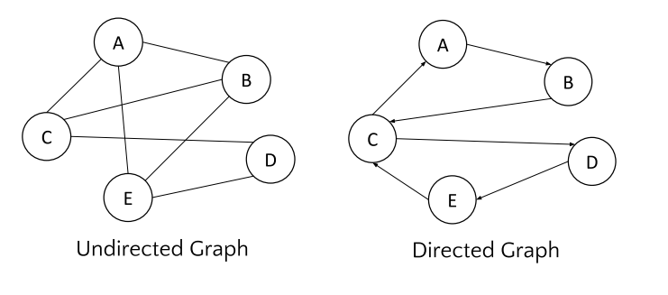
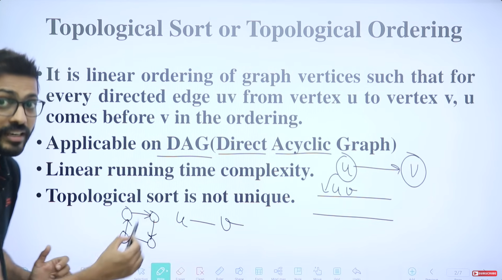
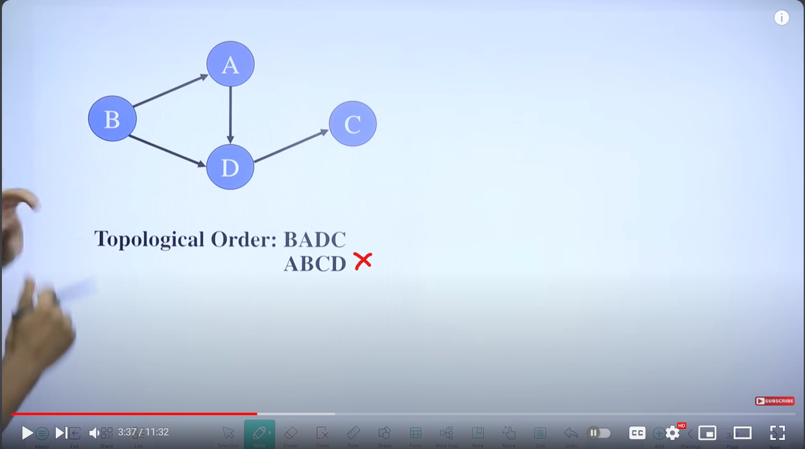
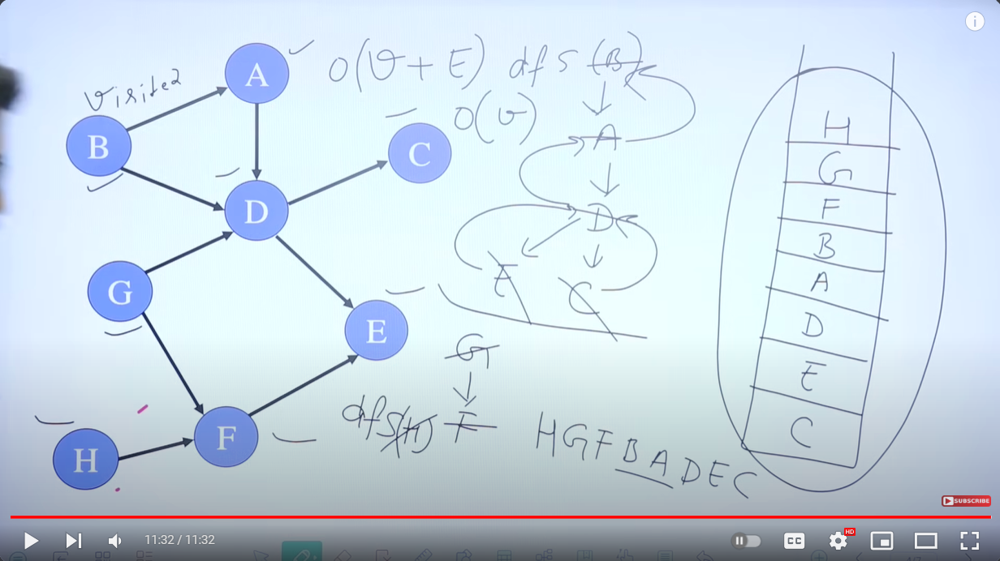

# Graph

- Graph is collection of vertices and edges.
- Graph G = (V, E) where V set of vertices and E set of edges.
- Type of graphs:
  
    1. Undirected Graph
    2. Directed Graph
    3. Weighted Graph



1. Undirected Graph:
    - Self loop is not allowd
2. Directed Graph:
    - Self loop is alloed.
3. Weighted Graph:
    - Each edge has an associated weight

## Terms:

1. Adjacent Nodes:
    - Two vertices are adjacent if they are endpoints of the same edge.
    - An edge is incident on a vertex if the vertex is an endpoint of the edge.
2. Outgoing edges:
    - Outgoing edges of a vertex are directed edges that the vertex is the origin.
3. Incoming edges:
    - Incoming edges of a vertex are directed edges that the vertex is the destination.
4. Degree of a vertex:
    - Degree of a vertex, v, denoted deg(v) is the number of incident edges.
    - Out-degree, outdeg(v), is the number of outgoing edges.
    - In-degree, indeg(v), is the number of incoming edges.
5. path:
    - A path is a sequence of vertices such that each vertex is adjacent to the next. In a path, each edge can be traveled only once.
    - The length of a path is the number of edges in that path.
6. Path:
    - Cycle(loop) is a path that starts and end at the same vertex
7. Adjacency relationship:
    - If (u, v) ∈ E, then vertex v is adjacent to vertex u.
    - Adjacency relationship is Symmetric if G is undirected, if G is directed the relationship is not symmetric.
8. Connected Graph:
    - There is a path between every pair of vertices.

​	

## Representation of Graphs

- Two standard ways, Adjacency Matrix, Adjacency Lists

## Traversing / Searching Graphs

- Standard graph-searching algorithms.
    1. Breadth-first Search (BFS).
    2. Depth-first Search (DFS).

## BFS

- Algorithm
  
    ```Plain
    BFS (G, s){
    	let Q be queue.
    	Q.enqueue(s)
    	mark s as visited.
    	while ( Q is not empty)
        {
    		v = Q.dequeue()
    		for all neighbors w of v in Graph G.
            {
    			if w is not visited.
    			Q.enqueue(w)
    			mark w as visited.
            }
        }
    }
    ```
    

## DFS

- Algorithm:
  
    ```Plain
    DFS (G, s){
    	let S be stack.
    	S.push(s)
    	mark s as visited.
    	while ( S is not empty)
        {
    		v = S.pop()
    		for all neighbors w of v in Graph G.
            {
    			if w is not visited.
    			Q.push(w)
    			mark w as visited.
            }
        }
    }
    ```


# Topological Sorting

- Topological sorting for ***Directed Acyclic Graph (DAG)*** is a linear ordering of vertices such that for every directed edge u-v, vertex ***u*** comes before ***v*** in the ordering.








# Shortest Path Algorithms

1. Minimum spanning tree
2. Dijkstra’s algorithm
3. Warshall’s algorithm