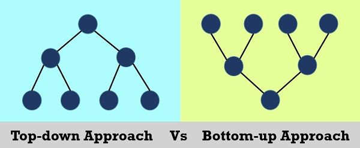
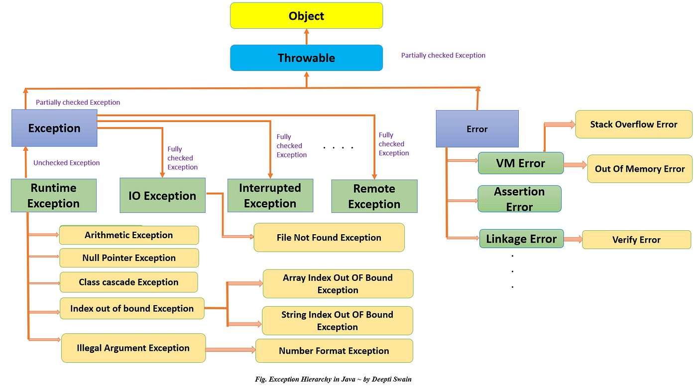

# Java

Java Interview Questions [Here](https://javatpoint.com/corejava-interview-questions)


Q. What is object orient programming

- OOP mainly focuses on the data rather then procedure.
- It is mainly based on the concept of objects & classes.


Q. What is class and object ?
- Class is a blueprint/template for creating objects.
- Class is user define data type.
- Object is instance of class.


Q. Object oriented vs Procedural oriented programming ?

|                   | Object-Oriented Programming (OOP)   | Procedural Programming                         | Functional Programming                |
| ----------------- | ----------------------------------- | ---------------------------------------------- | ------------------------------------- |
| Main Focus        | Data and Objects                    | Function, Step-by-step execution of procedures | Functions and their composition       |
| Complex           | Used to solved more complex program | Used to solved relatively less complex program |                                       |
| Example Languages | Java, C++, Python, Ruby, C#         | C, Fortran, Pascal, Basic, COBOL               | Haskell, Lisp, Scala, Clojure, Erlang |


Q. Top down vs Bottom up programming ?




Q. Garbage collector ?

- Garbage collector is, program which frees up the unutilized memory.
- Find & Delete, unreferenced object from the memory.
- Automatic memory management.


Q. Compiler vs Interpreter ?

```Plain
Compiler		- traslate entire program to machine code
Interpreter		- traslate code line by line and executes
	
JIT	            - only used to improve the performance			
				- traslate, when needed (compilation on the fly)
				- They identify sections of code that are frequently executed (hotspots)	
				- and translate these sections into machine code during runtime.
				- it can be multiple lines
				
				- can take example of function definition but without ever called. 
```

|                            | Compiler                                                                      | Interpreter                                                               | JIT Compiler                                                          |
| -------------------------- | ----------------------------------------------------------------------------- | ------------------------------------------------------------------------- | --------------------------------------------------------------------- |
| Execution Process          | Translates the entire source code into machine code before execution, at once | Reads and executes the source code line by line without prior translation | involves compilation (on the fly) during execution (not line by line) |
| Execution Speed            | Generally offers faster execution                                             | May have slower execution compared to compiled code                       | Can provide a performance boost over pure interpretation              |
| Portability                | Compiled code is typically platform-specific                                  | Interpreters can be platform-independent                                  | May generate platform-specific code for optimization                  |
| Examples                   | GCC (C/C++), Java Compiler                                                    | Python Interpreter                                                        | JavaScript, Java HotSpot JVM, .NET CLR (Common Language Runtime)      |
| Compilation/Execution Time | Longer compilation time, faster execution                                     | No compilation time, slower execution                                     | Initial compilation time, faster subsequent execution                 |


Q. Static vs dynamic language ?

|                            | Static Language (Strongly Typed Language)                    | Dynamic Language (Weakly Typed Language)                     |
| -------------------------- | ------------------------------------------------------------ | ------------------------------------------------------------ |
| Specification of data type | Must need to specify the data type of the variable.<br><br>Required. Ex. `int x = 10;` | Do not need to specify the data type of the variable.<br><br>Not required Ex. `let x = 10;` |
| Variable type Checking     | Performs thorough type checks at compile-time                | Performs thorough type checks at run-time                    |
| Variable Declaration       | Requires explicit type declarations                          | Type inference is common                                     |
| Compilation                | Compilation is typically required                            | Interpretation or just-in-time compilation                   |
| Examples                   | C, C++, Java, C#                                             | Python, Ruby, JavaScript, PHP, Perl                          |


Q. Programming language vs Scripting language ?

| Programming Language                        | Scripting Language                            |
| ------------------------------------------- | --------------------------------------------- |
| Often used for low level system programming | Often used for automation and web development |
| Example: Java, C++                          | JavaScript, Ruby, PHP, and Python(Both)       |


Q. Call by value vs Call by reference ?


Q. Mutable and Immutable data structure (string) ?

- Mutable data structures are those whose values can be modified after they are created.
- Java Ex. Object, Array,
- Immutable data structures are those whose values cannot be modified once created.
- Java Ex. Primitive, String


Q. What is the difference between final, finally and finalize in java?

| Keyword    | Usage                                       | Purpose                                                      |
| ---------- | ------------------------------------------- | ------------------------------------------------------------ |
| `final`    | Variable: `final int x = 10;`               | It makes a variable unmodifiable, meaning its value cannot be changed once assigned. |
|            | Method: `final void methodName() {...}`     | Prevents overriding of the method in subclasses.             |
|            | Class: `final class ClassName {...}`        | Prevents inheritance, making the class non-extendable.       |
| `finally`  | Used in try-catch blocks:                   | Guarantees execution of code whether an exception occurs or not. |
|            | `try { ... } catch { ... } finally { ... }` | It's used to execute code after try or catch blocks, ensuring cleanup or finalization tasks. |
| `finalize` | Method: `protected void finalize() {...}`   | A method in the `Object` class used for cleaning non object recourse / memory i.e. file discreptor, system fornt |
|            |                                             | It's called by the garbage collector before an object is destroyed. |
|            |                                             | Note: Deprecated method; discouraged to rely on for resource cleanup. |


Q. How do you log the exception and what are best practices (in java)

```Java
try{
	//
}
catch (Exception e){
    System.out.println(e.getMessage())
}
```


Q. Difference between checked and unchecked exception

| Checked Exception                                            | Unchecked Exception                                          |
| ------------------------------------------------------------ | ------------------------------------------------------------ |
| Compiler, check if error is handled or not.                  | Compiler, does not check if error is handled or not.         |
| Checked at compile-time. Code won't compile if not handled or not declared properly. | Not checked at compile-time. Compiler doesn't enforce handling or declaration. |
| Subclass of `Exception` excluding `RuntimeException`         | Subclass of `RuntimeException`                               |
| Must be handled explicitly using `try-catch` or `throws`     | Can be handled, but it's not mandatory                       |
| `IOException`, `SQLException`, `FileNotFoundException`       | `NullPointerException`, `ArrayIndexOutOfBoundsException`, `ArithmeticException` |




Q. Difference between throw and throws keyword in java

| Aspect               | `throw`                                                      | `throws`                                                     |
| -------------------- | ------------------------------------------------------------ | ------------------------------------------------------------ |
| Usage                | Used to manually throw Exception object.                     | Used in method signature to declare checked exceptions that might be thrown by the method. |
| Syntax               | `throw new SomeException();`                                 | `void methodName() throws SomeException {...}`               |
| Purpose              | Throws an exception instance explicitly within the code block. | Declares that a method may throw certain exceptions and delegates the responsibility of handling to the caller. |
| Location             | Used within a method or block (like try, if, etc...) to throw an exception. | Used in the method signature to indicate potential exceptions thrown by that method. |
| Single Exception     | Can throw only one exception at a time.                      | Can declare multiple exceptions separated by commas.         |
| Checked vs Unchecked | Can throw both checked and unchecked exceptions.             | Used primarily for declaring checked exceptions.             |


Q. Difference between reference copy and object copy ?


Q. Can you explain me shallow copy vs deep copy of object ? [Video](https://youtu.be/QaCYMgyprtc?si=ndbz_l8ciDBCIC81)
- Shallow copy, only copy the object's fields. and if object field is reference variable (like another object) then the shallow copy will copies references to the same objects (no new object created).
- This means that if the original object has reference variables, the new object will also have reference variables pointing to the same objects as the original object.
- On the other hand, a deep copy creates a new object by copying not only the reference values but also the object references within the instance variables.


Q. What is Java ?

- [Java](https://www.javatpoint.com/java-tutorial) is the high-level, [object-oriented](https://www.javatpoint.com/java-oops-concepts), robust, secure programming language, platform-independent, high performance, Multithreaded, and portable programming language.
- It was developed by James Gosling in June 1991. It can also be known as the platform as it provides its own JRE and API.


Q. What are the differences between C++ and Java ?

- Pointer, Structure, Union, Multiple inheritance, Operator Overloading is not supported in java


Q. what is four pillars of oops?

- Abstraction -  Hiding the implementation details
- Encapsulation - Wrapping up data and methods into single unit (called class).
- Inheritance -  Properties and methods one class acquired by another class.
- Polymorphism - Ability to take more then one forms.


Q. What is inheritance?

Q. Inheritance implemented at runtime or compile time ?

- Inheritance is achieved at compile time.


Q. What is polymorphism ?

Q. Type of polymorphism ?


Q. 'is-a', 'has-a' kinda questions asked in radixWeb.


Q. Difference between Abstract Class and Interface 

| Abstract class                                               | Interface                                                    |
| :----------------------------------------------------------- | :----------------------------------------------------------- |
| Variable - final, non-final, static & not-static<br />Method - abstract & not abstract | Variable - only final & static<br />Method - only abstract   |
| A Java **abstract class** can have class members like public, private, protected, etc. | Members of a Java interface are public by default.           |
| An **abstract class** can extend another Java class and implement multiple Java interfaces. | An **interface** can extend another Java interface only.     |
| Abstract class **doesn't support multiple inheritance**.     | Interface **supports multiple inheritance**.                 |
| Abstract class **can provide the implementation of interface**. | Interface **can't provide the implementation of abstract class**. |
| The **abstract keyword** is used to declare abstract class.  | The **interface keyword** is used to declare interface.      |
| An **abstract class** can be extended using keyword "extends". | An **interface** can be implemented using keyword "implements". |

- Both Abstract class and Interface can not be instantiated.

