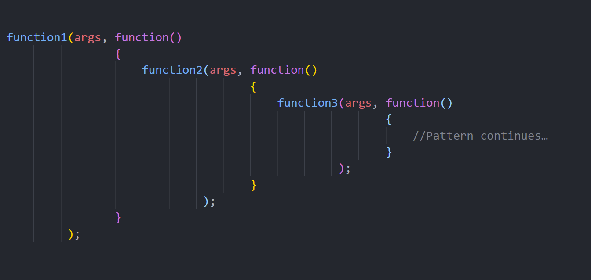

# Javascript

Q. What is JavaScript ?

- JavaScript is a high-level, object oriented programming language primarily used for adding interactivity and dynamic functionality to web pages.
- It runs on the client-side and can also be used on the server-side (with Node.js).
- Mobile Application : react-native, ionic.js
- Desktop Application : electron.js

Q. What are the different data types in JavaScript?

- 8 Data types
- 7 data types are primitive:
  1. Number
  2. String
  3. Boolean
  4. Undefined
  5. Null
  6. BigInt
  7. Symbol
- and `object` which is non primitive data-type.

Q. What is the difference between `null` and `undefined` ?

- `null` represents the intentional absence of any object value, While `undefined` represents the absence of a defined value.
- `null` is assigned, while `undefined` is typically the default value for uninitialized variables.
- `typeof null -> object` 
- `typeof undefined -> undefined` 

Q. Whats are the features introduced in ES6

```
1. let & const
2. Distructuring assignment
3. Rest & Spread operator
4. Templete literal
5. Arrow function
6. Class & Modules
7. Map & Sets
8. for...of
```

Q. What is the difference between `let`, `const`, and `var` in JavaScript ?

- `let` and `const` are introduced in ES6.

```
The main defference is in:
1. Redeclaration
2. Reassignment
3. Scope
4. Hoisting
```

- Redeclaring of variable is possible with `var` not in `let` & `const`.
- Reassignment of variable is not possible with `const`.
- `var` does not support block scope, while `let` & `const` support block scope. (All three support function/global scope).
- `var` support hoisting but `let` & `const` do not.
- `var` available in window but `let` & `const` do not.

| **Keyword**                    | **var**             | **let**                 | **const**               |
| ------------------------------ | ------------------- | ----------------------- | ----------------------- |
| Re-declarable                  | yes                 | no                      | no                      |
| Re-assignable                  | yes                 | yes                     | no                      |
| Must initialize at declaration | no                  | no                      | yes                     |
| Global scope                   | yes                 | [yes]                   | [yes]                   |
| Function scope                 | yes                 | yes                     | yes                     |
| Block scope                    | no                  | yes                     | yes                     |
| can be hoisted                 | yes                 | [no] (TDZ)              | [no] (TDZ)              |
|                                | Available in window | Not available in window | Not available in window |

Q. What is the difference between `==` and `===` operators in JavaScript ?

- The `===` operator, checks for both equality of `value` and `type` of operands, without performing type coercion, also known as the strict equality operator.
- The `==` operator checks for equality of `value` of operands and perform type conversion if needed.

Q. What is Optional chaining `?.`

- The optional chaining `?.` is a safe way to access nested object properties.
- Does not give error - Even if an intermediate property doesn't exist.
- It returns `undefined` if intermidate property does not exists.

Q. What is Nullish Coalesing Operator `??` ?

- Nullish coalesing operator `(??)` that works like OR `(||)` operator but it only return the second expression, when the first one is `nullish` (null or undefined)
- OR operator returns evaluation of second expression, only if first expression evaluates to falsy value.
- Falsy values : false, zero, empty string, null, undefined, NaN

Q. What is Destructuring assignment, Spread operator, And Rest Parameter ?

Destructuring assignment :

- Extract the value from array & object.

Spread Operator :

- Unpack the values of array, object, string etc.
- Example:

```
...[a, b, c] --> a b c

   rest = [a,b,c]
...rest = a, b, c
const arrValue = ['My', 'name', 'is', 'Jack'];

console.log(arrValue);      // ["My", "name", "is", "Jack"]
console.log(...arrValue);   // My name is Jack

// Copy Array Using Spread Operator :
const arr1 = ['one', 'two'];
const arr2 = [...arr1, 'three', 'four', 'five'];
```

Rest parameter:

- Pack the values as an array.
- It usally last argument of the function, accept an indefinite number of arguments as an array.
- Example :

```
let func = function(...args) {
    console.log(args);
}

func(3);        // [3]
func(4, 5, 6);  // [4, 5, 6]
```

Q. What is `typeof`, `void`, `in` and `instanceof` operator ?

- The void operator evaluates the given expression and then return undefined.

Q. What is `NaN` ?

- Not a number
- Not a legal number
- eg, parsing invalid number

Q. How many type of scope available in js ?

- Three, 1) Global scope 2) Function scope 3) Block scope

Q. What is hoisting ?

- Variable | function declaration lifed to top of the scope.
- A variable | function can be used before it has declared.
- Only variable declaration are hoisted to top, not variable initialization.
- Example :

```
var a = 10;
console.log(a);
console.log(b);
var b = 13;
```

Treated as . . .

```
var a;
var b;

a = 10;
console.log(a);
console.log(b);
b = 13;
```

Q. Strict Mode in javascript ?

- It helps us to write cleaner, bug free code, and prevent unnecessary errors.
- Strict mode is declare by adding `"use strict";` expression to beginning of a script or function (beginning of scope).
- In strict mode...
  - Variable declaration / initialization without `var`, `let` or `const` it, is not allowed.
  - Redeclation of variable also with `var` is not allowed.
  - The `this` keyword inside function, is 'undefined'.
  - Deleting a variable, object or function is not allowed.
  - Duplicating a parameter name in function is not allowed.
  - Writing to a read-only / get-only object property is not allowed.
  - Deleting an undeletable property is not allowed.
  - The word eval/arguments cannot be used as a variable.

Q. What is the purpose of the `this` keyword in JavaScript ?

- The `this` is reference variable - referes to object.

- Actually it refers to different object based on context.

- Value of `this` keyword...

  - In an object `method`, this refers to the enclosing object.
  - `Alone, this` refers to the global object.
  - In `function`, this refers to the global object. [ '' in ]
  - In `function, with strict mode`, this refers to the undefined.
  - In an `event` handle function, this refers to the `element` in which event occurred.

Q. Error handing in javascript ?

- Syntax:

```
try
{
 // code may generate exception
}
catch ( catchID ) {
 // Code to run if an exception occurs
}
[finally {
 // Code that is always executed regardless of an exception occurring
}]

// You can raise an exception using a primitive or an object and
// then you can capture that exception using a try...catch block.
throw expression;

//
// Custom Error
class CustomError extends Error {
    constructor( foo = 'bar', ...params) {
        // Pass remaining arguments to parent constructor
        super(...params);

        this.name = 'CustomError';

        // Custom debugging information
        this.foo = foo
        this.date = new Date()
      }
}

try
{
    throw new CustomError('baz', 'bazMessage')
}
catch(e)
{
    console.error(e.name)    // CustomError
    console.error(e.foo)     // baz
    console.error(e.message) // bazMessage
    console.error(e.stack)   // stacktrace
}
```

Q. difference between `for...in` and `for...of` loop?

- for ... in iterate through key of an object.
- for ... of iterate through Array (or iterable).

Q. Difference between arrow function and normal function:

Arrow function

- Does not have its `this`. so it uses lexical (outer) this.
- Does not have its `argument` object.

Q. What is immediately invoked function expression?

- Function that runs as soon as it defined

Q. difference between call(), apply(), and bind() ?

- These methods are use to manually bind the value of `this` to another value, for function.
- Syntax :

```
functionName.call(thisArg, arg1, agr2, ...)
// binds and call immediatly, it returns the value that retrun by function.

functionName.apply(thisArg, [argumentsArr])
// bind and call immediatly, accept argument array, similar to call()

functionName.bind(thisArg, arg1, arg2, ...);
// only binds, returns new bounded funcion.
```

Example :

```
let p1 = {
    Name : 'viral'
}
let p2 = {
    Name : 'harry'
}
let p3 = {
    Name : 'elon'
}

function func(a=13, b=17){
    console.log(`${this.Name} : ${a} : ${b}`);
}

func.call(p1);                          // viral : 13 : 17
func.apply(p2,[25]);                	// harray : 25 : 17
let x = func.bind(p3,10,15);    		// elon : 10 : 15
x();                                    // no need to pass argument again.
```

Output :

```
viral : 13 : 17
harry : 25 : 17
elon : 10 : 15
```

Q. What is argument object in function ?

- You can refer to a function's arguments within the function by using the arguments object.
- It has key as '0', '1', '2'...

Q. What are closures in JavaScript ?

- Function combined with its outer scope forms closure.
- `Inner function have access to variables from its outer function's scope`, even after the outer function has finished executing.
- They allow data encapsulation and can be used to create private variables and functions.
- Example:

```
function add(a,b){
    function inner(c){
        return a+b+c;
    }
    return inner;
}

let x = add(5,10);
let y = add(100,150)
x(15)       //30
y(50)       //300
```

Q. What is lexical environment?

- A lexical environment in JavaScript is **a data structure that stores variables and functions defined in the current scope, along with references to all outer scopes**.

Q. Advantages of clouse ?

- Closures provide data encapsulation.
- Used in function curring.
- Closures help maintain modular code.
- Closures allow you to attach variables to an execution context.

Q. Disadvantages of clouses ?

- Overconsumption of memory.
- Variable from lexical scope can not be garbage collected.

Q. What is modular code ?

- This means that you can break down your code into smaller, more manageable pieces.
- This can make your code easier to understand and maintain.

Q. What is curring in javascript ?

- Transforms function with multiple arguments into multiple nested function of a single .

Q. Why is currying useful in JavaScript ?

- It helps us to create a higher-order function.
- It helps us to avoid passing the same parameter multiple times.
- It makes the code more readable.

Q. What is Higher order function ?

- A higher order function is a function that takes a another 'function' as an argument, or returns a 'function'.
- HOFs enable functional programming paradigms and provide flexibility in composing functions.
- Example:

```js
const numbers = [1, 2, 3, 4];
// map() is the higher-order function, and the arrow function is the callback.
const doubledNumbers = numbers.map(num => num * 2);
console.log(doubledNumbers); // Output: [2, 4, 6, 8]
```


Q. Why and When to use Higher order function ?


Q. What is Callback functions ?

- A callback is a function passed as an argument to another function.
- Which will be executed at a later point, after a particular event occurs.
- It enables asynchronous and event-driven programming in JavaScript.


Q. What is callback hell ?

- If we nest, multiple callback function then it from pyramid like structure, called callback hell.
- Reduce readability and maintainability of the code.



Q. What is `setTimeOut()` and `setInterval()` ?

- setTimeOut() : Executes a function (only one time), after waiting a specified amount of milliseconds.
- The clearTimeout() method stops the execution of the function specified in setTimeout().
- setInterval() : Executes a function (repeatedly), after waiting a specified amount of milliseconds.
- The clearInterval() method stops the executions of the function specified in the setInterval() method.

Q. What is the differece between `slice()` and `splice()` method.

1. `slice()`:
   - Create a new sub array based on start and end index.
   - Does not modify the original array.
   - Syntax: `array.slice(startIndex, endIndex)`
   - Return value: A new array containing the extracted elements.

2. `splice()`:
   - The `splice()` method is used to add, remove, or replace elements for array.
   - It modifies the original array.
   - Syntax: `array.splice(startIndex, deleteCount, item1, item2, ...)`
   - Return value: An array containing the removed elements. If elements are not removed (deleteCount is 0), an empty array is returned.

Q. What is the purpose of the `map()` function in JavaScript? Provide an example.

- The `map()` function is used to create a new array by transforming each element of an existing array.
- It applies a provided function to each element and returns the results in a new array of the same length.

Q. What is the difference between `substr()` and `substring()`

- The `substr()` method takes two arguments: the starting index and the `length`.
- The `substring()` method takes two arguments: the starting index and the `ending index`.

Q. What is Map and Set ?

- Maps are similar to objects as that they can map a key to a value, remembers the original insertion order of the keys.
- Sets are similar to arrays except that duplicate are not allowed.

Q. What are Promises in JavaScript ?

- Handle asynchronous operations.
- A Promise is an object, representing the completion or failure of an asynchronous operation.
- then() and catch()

Q. What are the different Promise state?

- A promise has three stats :

| **States** | **Description**                                              |
| ---------- | ------------------------------------------------------------ |
| pending    | initial state, neither fulfilled nor rejected                |
| resolved   | meaning that the operation was completed successfully (settled) |
| rejected   | meaning that the operation failed (settled)                  |

Q. What is async/await in JavaScript?

- `async/await` introduced in ES8 that simplifies the syntax of promise.
- `Async` makes a function return a Promise. ( works asynchronous )
- The `await` keyword pause the function execution and wait for a resolved promise before it continues
- `await` returns `resolve value` or `error` in case of rejection reason of promise.

Q. What are modules in JavaScript?

- Module is group of code, which can be reused.

Q. What is event capturing and bubbling ?

- In event capturing, event travels/propagate from the root to the target.
- In event bubbling, event travels/propagate from the target to the root.

Q. What is event delegation in JavaScript ?

- Event delegation is a technique where you attach an event listener to a parent element and handle events for its child elements.
- It allows you to manage events efficiently, especially for dynamically added or large numbers of elements.
- Example:

```
const div = document.querySelector('div')

div.addEventListener("click", (event) => {
    if(event.target.tagName === 'BUTTON') {
        console.log(event.target.innerText)
    }

    // event.target.nodeName === 'button'
})
```

Q. What is AJAX in JavaScript ?

- AJAX (Asynchronous JavaScript and XML) is a technique used to send and retrieve data from a server asynchronously without reloading page.
- It enables building dynamic web applications by updating content without requiring a full page reload.

Q. What is the Event Loop in JavaScript ?

- It manages the execution of all asynchronous code.
- It continuously looks for the callback queue, and executes first callback function that are ready to execute.
- It handles tasks such as handling events, executing callbacks.
- All the code that is inside callback function are executed in event loop. (code which is not top level code is executed in event loop)

Q. What is the differece between `cookies`, `session` and `local storage`.

| **Cookies**                                                  | **Session**                                                 | **localStorage**                                             |
| ------------------------------------------------------------ | ----------------------------------------------------------- | ------------------------------------------------------------ |
| Cookies have a storage capacity of **4 KB**.                 | The session storage has a **5MB** storage capacity.         | Local storage has a **5MB** or **10MB** storage              |
| Can have an expiration date                                  | Cleared when the session ends (browser tab closed)          | It can only be removed from the browser, manually or using **JavaScript**. |
| There is a data (cookie) transfer to the server.             |                                                             |                                                              |
| Cookies are the most well-known and oldest (**HTML4-based**) method. | HTML5 has a brand-new feature called **"Session Storage".** |                                                              |

Q. What will be the output of the following code snippet?

```
console.log("1" + 5); // 15 - string concatenation
console.log(1 + "5"); // 15 - string concatenation
```

Q. What will be the output ?

```
let a = {};
let b = { key: "b" };
let c = { key: "c" };

a[b] = 123;
a[c] = 456;

console.log(a[b]);
// 456
```

Q. What will be the output of the above code ?

```
let myArr = [];
for (i = 0; i < 3; i++) {
    myArr.push(function () {
        console.log(i);
    })
}
for (j = 0; j < 3; j++) {
    myArr[j]();
}
```

Output: 3 3 3

Q. What will be the output of the above code ?

```
let myArr = [];
for (let i = 0; i < 3; i++) {
    myArr.push(function () {
        console.log(i);
    })
}
for (let j = 0; j < 3; j++) {
    myArr[j]();
}
```

Output: 0 1 2

Q. Explain data encapsulation ?

- Wrapping up data and method into single unit (class).
- Encapsulation in JavaScript used to create private / secure data members.
- Example:

```
function counter(){
    let count = 0;
    return function increment(){
        count++;
        console.log(count);
    }
}

let counter1 = counter();
counter1();
function Counter(){
    let count = 0;
    this.increment = function(){
        count++;
        console.log(count);
    }
    this.decrement = function(){
        count--
        console.log(count);
    }
}

let counter1 = new Counter();

counter1.increment();
counter1.decrement();
```

Q. Explain garbage collector? How closure and garbage collector related to each other ?

- Garbage collector is program which frees up the unutilized memory.
- Example :

```
function f1(){
    let a = 10;
    return function(){
        console.log(a);
    }
}

let f = f1();
// ideally what should happens, is when, f1 is executed completly, all its memory should be free.
// but because of closure, a can not be.
```

Q. Explain inheritance in javascript ?