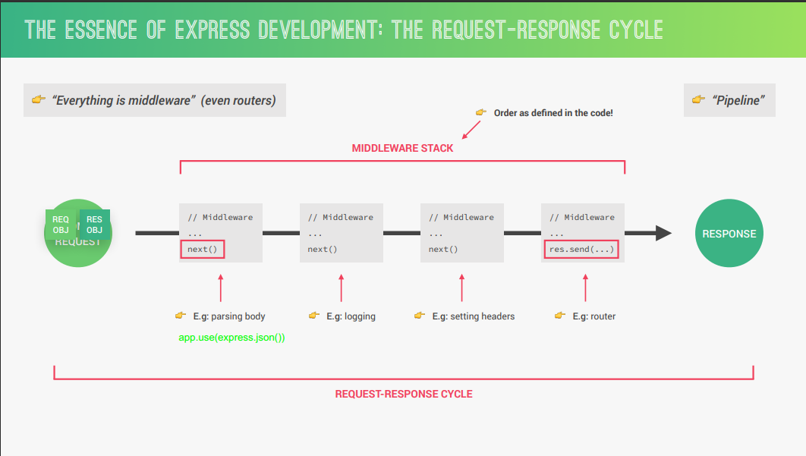

## Express

- Express is a minimal node.js framework, built on top of node.js.
- Express contains a very robust set of features like complex routing, easier handling of requests and responses, middleware, server-side rendering etc.
- Express allows for rapid development of node.js applications: we don’t have to re-invent the wheel.
- Express makes it easier to organize our application into the MVC architecture.
  

### Install Express

- write following code to terminal to install express.
  
    ```Plain
    npm install express
    ```
    

### Hello World Example

- Example :
  
    ```Plain
    const express = require('express');
    const app = express();
    
    app.use(express.json());
    
    app.get('/', (req, res) => {
      res.send('Hello World!');
    })
    
    const port = 3000;
    app.listen(port, () => {
      console.log(`Example app listening on port ${port}`);
    })
    ```
    

`express()` : This method returns instance of express (**app**).

`app.get('url', callbacks)` : Handles the get request comes at `/` path.

`res.send()` : Sends back response.

`app.listen(port, callback)` : Start listening at specific port.


### Methods of Express

```
express()
express.static()
express.json()
express.raw()
express.text()
express.urlencoded()
express.Router()
```

### Basic routing :

- Routing refers to determining how an application responds, to a client request to a particular endpoint, which is a URI (or path) and a specific HTTP request method (GET, POST, and so on).
- Route definition takes the following structure :
  
    ```JavaScript
    app.METHOD(PATH, HANDLER)
    ```
    
    `METHOD` can be :
    
    ```Plain
    get()        	- Read
    post()       	- Create
    put()        	- Update
    patch()        	- Update
    delete()    	- Delete
    all()
    ```
    

### Middleware :

- Middleware functions are functions that have access to the `request object (req)`, the `response object (res)`, and the next middleware function in the application’s request-response cycle.
- These functions are used to modify **req** and **res** objects for tasks like parsing request bodies, adding response headers, etc.
- Example :
  
    ```Plain
    var express = require('express');
    var app = express();
    
    //Simple request time logger
    app.use(function(req, res, next){
       console.log("A new request received at " + Date.now());
       next();
    });
    
    app.listen(3000);
    ```
    
- The above middleware is called for every request on the server.
- To restrict it to a specific route (and all its sub routes), provide that route as the first argument of _**app.use()\**_.
- Example :
  
    ```Plain
    var express = require('express');
    var app = express();
    
    //Middleware function to log request protocol
    app.use('/things', function(req, res, next){
       console.log("A request for things received at " + Date.now());
       next();
    });
    
    // Route handler that sends the response
    app.get('/things', function(req, res){
       res.send('Things');
    });
    
    app.listen(3000);
    ```
    

  

