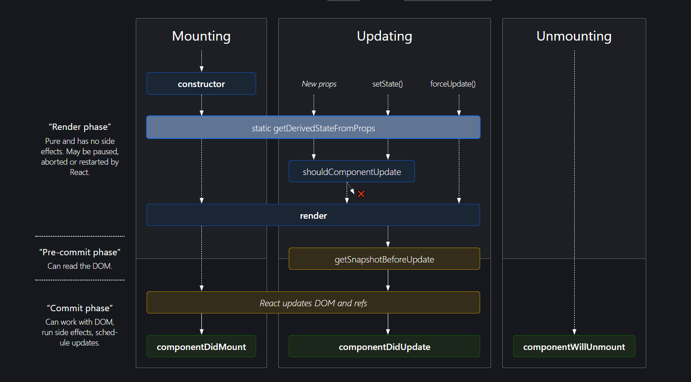

# Component Life Cycle

- Lifecycle methods are series of methods that executes throughout the birth, growth, and death of a React component.




## What is the React component lifecycle?

- In React, components go through following a lifecycle of events:
    1. Mounting ( Adding nodes to the DOM )
    2. Updating ( Altering existing nodes in the DOM )
    3. Unmounting ( Removing nodes from the DOM )
    4. Error handling ( Verifying that your code works and is bug-free )
- You can think of these events as a component’s birth, growth, and death, respectively. Error handling is like an annual physical.
- Example
  
    Let’s look at a simple example. If I told you to build a Hello World component, you might write something like this:
    
    ```JavaScript
    class HelloWorld extends React.Component {
       render() {
        return <h1> Hello World </h1>
       }
    }
    ```
    
- The following diagram shows the React lifecycle :
- Note that a React component may not go through every phase. For example, a component could be mounted one minute and then unmounted the next without any updates or error handling.
  
    ![[react-lifecycle-diagram.png]]
    

  

## What are React lifecycle methods ?

- Each React lifecycle phase has a number of lifecycle methods that you can override to run code at specified times during the process.
- These are popularly known as component lifecycle methods.

  

## Mounting lifecycle methods

- The mounting phase refers to the phase during which a component is created and inserted to the DOM.
- Following life cycle methods invoked when the component is to be created.

### constructor() :

- The `constructor()` is the very first method called as the component is “brought to life.”
- The constructor method is called before the component is mounted to the DOM.
- In most cases, you would initialize state and bind event handlers methods within the constructor method.
  
    Example :
    
    ```JavaScript
    const MyComponent extends React.Component {
      constructor(props) {
       super(props)
        this.state = {
           points: 0
        }
        this.handlePoints = this.handlePoints.bind(this)
        }
    }
    ```
    

  

### static getDerivedStateFromProps()

- This method is called (or invoked) before the component is rendered to the DOM on initial mount.
- Its main function is to ensure that the state and props are in sync for when it’s required.
- The method name `getDerivedStateFromProps` comprises five words: get derived state from props. Essentially, `static getDerivedStateFromProps(props, state)` allows a component to update its internal state in response to a change in props.
  
    Component state in this manner is referred to as [derived state](https://reactjs.org/blog/2018/06/07/you-probably-dont-need-derived-state.html#when-to-use-derived-state).
    

  

![[static-getDerivedStateFromProps-diagram.png]]

  

- The basic structure of the `static getDerivedStateFromProps()` looks like this.
- `static getDerivedStateFromProps()` takes in `props` and `state`.
  
    ```JavaScript
    const MyComponent extends React.Component {
      static getDerivedStateFromProps(props, state) {
    	// Do stuff here
      }
    }
    ```
    
- You can return an object to update the state of the component.
  
    ```JavaScript
    static getDerivedStateFromProps(props, state) {
    	return {
    		points: 200 // update state with this
    	}
    }
    
    // Or you can return null to make no updates.
    
    static getDerivedStateFromProps(props, state) {
    	return null
    }
    ```
    

### rendor()

- After the `static getDerivedStateFromProps` method is called, the next lifecycle method in line is the `render` method.
- If you want to render elements to the DOM, - e.g., returning some `JSX` - the `render` method is where you would write this.
- rendor() method called when...
  
    - component gets rendor first time
    - `state` updated ( reRendor )
    - `props` updated ( reRendor )
    
    ```JavaScript
    class MyComponent extends React.Component {
    	// render is the only required method for a class component
    	render() {
        	return <h1> Hurray! </h1>
       	}
    }
    ```
    
- You could also return plain strings, numbers, arrays, fragments, boolean, null, portal etc.. from the render method.
- An important thing to note about the render method is that the render function should be pure i.e do not attempt to use `setState`or interact with the external APIs.

### componentDidMount()

- After `render` method is called, the component is mounted to the DOM and the `componentDidMount` method is invoked.
- This function is invoked immediately after the component is mounted to the DOM.
- If you also want to make network requests as soon as the component is mounted to the DOM, this is a perfect place to do so.
- You would use the `componentDidMount` lifecycle method to grab a DOM node from the component tree immediately after it’s mounted.
  
    Example :
    
    ```JavaScript
    class ModalContent extends React.Component {
    
      el = document.createElement("section");
    
      componentDidMount() {
        document.querySelector("body").appendChild(this.el);
      }
    }
    ```
    

## Updating lifecycle methods

- Whenever a change is made to the `state` or `props` of a React component, the component is rerendered. This is the updating phase of the React component lifecycle.
- Following life cycle methods invoked when the component is to be updated.

### static getDerivedStateFromProps()

- The `static getDerivedStateFromProps` is the first React lifecycle method to be invoked during the updating phase.
- This method is invoked in both the mounting and updating phases.

### shouldComponentUpdate()

- In most cases, you’ll want a component to rerender when `state` or `props` changes. However, you do have control over this behavior.
- Once the `static getDerivedStateFromProps` method is called, the `shouldComponentUpdate` method is called next.
- Within this lifecycle method, you can return a boolean `true` or `false` and control whether the component gets rerendered ( upon a change in state or props ).
  
  ​    
  
    ![[shouldcomponendupdate-react-lifecycle-method-example.png]]
  

### render()

- After the `shouldComponentUpdate` method is called, `render` is called immediately afterward, depending on the returned value from `shouldComponentUpdate`, which defaults to `true` .

### getSnapshotBeforeUpdate()

- The `getSnapshotBeforeUpdate` lifecycle method stores the previous values of the state after the DOM is updated. `getSnapshotBeforeUpdate()` is called right after the `render` method.
- General form of getSnapshotBeforeUpdate() method would looks like.
  
    ```JavaScript
    getSnapshotBeforeUpdate(prevProps, prevState) {
       return value || null // where 'value' is a  valid JavaScript value
    }
    ```
    

### componentDidUpdate()

- The `componentDidUpdate` lifecycle method is invoked after the `getSnapshotBeforeUpdate`.
- It receives the previous props and state as arguments. general form of componentDidUpdate look like...
  
    ```JavaScript
    componentDidUpdate(prevProps, prevState) {
    }
    ```
    
    Example :
    
    ```JavaScript
    class App extends React.Component {
        constructor() {
            super();
            console.log("App constructor");
            this.state = {
                count : 0
            };
        }
        render() {
            console.log("App render");
            return (
                <div className="text-violet-400 md:text-red-400">
                    <h1>Hello World {this.state.count} </h1>
                    <button onClick={ ()=>this.setState({count : this.state.count+1}) } >Update</button>
                </div>
            );
        }
        getSnapshotBeforeUpdate(prevProps, prevState){
          return 10;
        }
        componentDidUpdate(prevProps, prevState, snapshot) {
            console.log("App componentDidUpdate", prevProps, prevState.count, snapshot);
        }
    }
    
    // OUTPUT :
    // App constructor
    // App render
    // [BUTTON CLICK]
    // App render
    // App componentDidUpdate {} 0 10
    ```
    

## Unmounting lifecycle method

- The following method is invoked during the component unmounting phase:

### componentWillUnmount()

- The `componentWillUnmount` lifecycle method is invoked immediately before a component is unmounted and destroyed.
- This is the ideal place to perform any necessary cleanup such as clearing up timers, cancelling network requests, or cleaning up any subscriptions.
  
    Example :
    
    ```Plain
    // e.g add event listener
    componentDidMount() {
        el.addEventListener()
    }
    
    // e.g remove event listener
    componentWillUnmount() {
        el.removeEventListener()
     }
    ```
    

  

## Error handling lifecycle methods