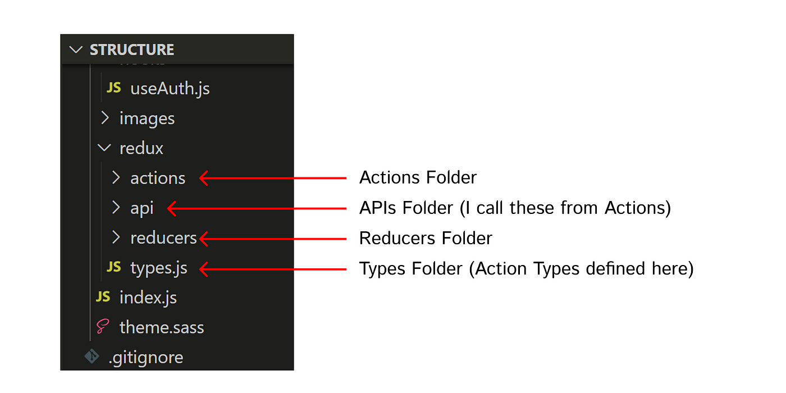
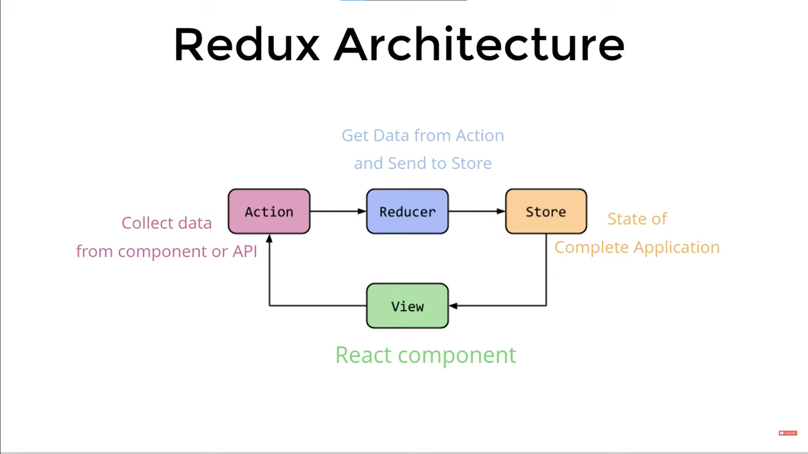

# Introduction

- Redux is a state management library for JavaScript applications, commonly used with React.
- Redux helps you manage the state of your application in a single global store.
- Redux follows a unidirectional data flow pattern and stores the application state in a single immutable state tree.
- Redux internally uses `props` to pass data.
- Redux stores all states in a single global state object.
- The whole global state of your app is stored in an object tree inside a single _store_. The only way to change the state tree is to create an action, an object describing what happened, and _dispatch_ it to the store. 

# React-Redux

- React-Redux is the official Redux binding for React.
- It provides a set of components and hooks that integrate Redux with React applications seamlessly.
- To use Redux in a React application, follow these steps:

### Installation

```shell
npm install redux react-redux
```

### Redux Reducers

Reducers specify how the state changes in response to actions. They are pure functions with the following signature:

```JavaScript
// Way 1 :

function reducer1(state = 5, action) {
    switch (action.type) {
        case "INCREMENT":
            return state + 1;
        case "DECREMENT":
            return state - 1;
        default:
            return state;
    }
}

// Way 2 :

let initialState = { counter : 0 }

function reducer2(state = initialState, action) {
    switch (action.type) {
        case "INCREMENT":
            return {
                ...state,
                counter : state.counter + action.payload
            };
        case "DECREMENT":
            return {
                ...state,
                counter : state.counter - action.payload
            };
        default:
            return state;
    }
}
```

- In the above example, the reducer handles the `'INCREMENT'` action type by returning a new state object with the counter value incremented by the payload.
- For each reducer function, redux create key/property/state, in global state store object. like…

```JavaScript
state {
    reducer1 : 0,
    reducer2 : { counter : 0 }
}
```

### Redux Actions

Actions in Redux describe the intention to change the state. Here's an example of a Redux action :

```JavaScript
const incrementCounter = (amount) => {
  return {
    type: 'INCREMENT_COUNTER',
    payload: amount
  };
};
```

In the above example, `incrementCounter` is an action creator function that returns an action object with a `type` property set to `'INCREMENT_COUNTER'` and an optional `payload` for additional data.

### Creating a store

- Create a Redux store using `createStore()` and pass in the reducer function or root reducer:

```JavaScript
import { createStore } from 'redux';

// Reducer
function counter (state = { value: 0 }, action) {
  switch (action.type) {
  case 'INCREMENT':
    return { value: state.value + 1 }
  case 'DECREMENT':
    return { value: state.value - 1 }
  default:
    return state
  }
}

let store = createStore(counter)

export default store;
```

### Combining reducers

- We can combine multiple reducer function using `combineReducer` function with takes all object of all reducer function.

```JavaScript
import { createStore } from 'redux';
import {combineReducers} from  "redux";

const rootReducer = combineReducers({
  counter, user, store
})

let store = createStore(rootReducer)

export default store;
```

### Provider

- Wrap your React application with the `Provider` component from React-Redux, and pass the store as a prop:

```jsx
import { Provider } from 'react-redux';
import store from "xyz";

ReactDOM.render(
  <Provider store={store}>
    <App />
  </Provider>,
  document.getElementById('root')
);
```

### Using a store

```JavaScript
let store = createStore(counter)

// Dispatches an action; this changes the state
store.dispatch({ type: 'INCREMENT' })
store.dispatch({ type: 'DECREMENT' })

// Gets the current state
store.getState()

// Listens for changes
store.subscribe(() => { ... })
// It will be called any time an action is dispatched and some part of the state tree may potentially have changed. 
```

### useSelector Hook

- The `useSelector` hook is used to extract data from the Redux store in your functional components. It accepts a selector function as an argument, which defines what state to retrieve from the store.

```jsx
import { useSelector } from 'react-redux';

function MyComponent() {
  const counter = useSelector(state => state.counter.value);

  return (
    <div>
      <p>Counter value: {counter}</p>
    </div>
  );
}
```

### useDispatch Hook

- The `useDispatch` hook is used to dispatch actions from your functional components.
- It returns a reference to the `dispatch` function provided by the Redux store.

```jsx
import { useDispatch } from 'react-redux';

function MyComponent() {
  const dispatch = useDispatch();

  return (
    <div>
      <button onClick={()=>dispatch({ type: 'INCREMENT' })}>Increment</button>
    </div>
  );
}
```

- If two reducer functions have the same action type, like "INCREMENT" in `userCounter` and `numberCounter`, both reducers will receive the action when it is dispatched. However, each reducer is responsible for handling its own portion of the state, so they can handle the same action type differently.
- It's up to each reducer to decide how to update its portion of the state based on the action.
- The order in which the reducers are called is determined by the way you combine them.

# Redux Folder Structure




# Redux Core Concepts

**Store**

- The store is a single source of truth that holds the complete state tree of your application.
- It is created using the `createStore` function from the Redux library.
- It is the single source of truth and can be accessed using functions like `getState()` and `dispatch()`

**Actions**

- Actions are plain JavaScript objects that describe an intention to change the state.
- They must have a `type` property indicating the type of action being performed and can optionally include additional data.

**Reducers**

- Reducers are pure functions that specify how the application's state changes in response to actions.
- They take the current state and an action as arguments and return the next state.
- Reducers should not mutate the state, instead, they create new state objects.

**Dispatch**

- Dispatching an action is the process of sending it to the Redux store.
- It is done using the `dispatch` method available in the store.
- The store then calls the reducer, which calculates the new state based on the current state and the action.

**Subscribing**

- You can subscribe to the store to receive notifications whenever the state changes.
- The `subscribe` method allows you to register callback functions that are called whenever an action is dispatched and the state is updated.
  

