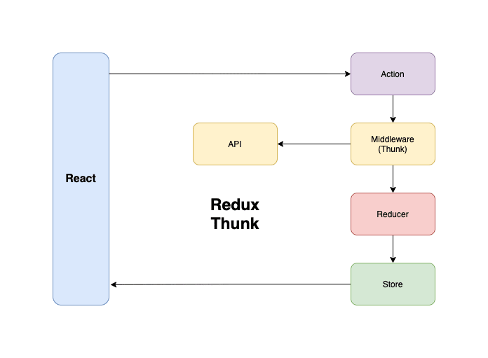

  

# Redux Thunk

- Redux Thunk middleware allows you to write action creators that return a function instead of an action.
- It is used to write actions that return promises or generators, which can be dispatched and handled easily within the Redux store.
- The purpose of middleware is to intercept an action before it reaches the reducer.
- Instead of sending the action to the reducer directly we will send it to middleware first.
- It can not change state, for changing state only reducer is responsible. but it can add/update data to action payload.

  



# Installation

```Plain
npm i redux-thunk
```

  

### Redux Toolkit

- If you're using [our official Redux Toolkit package](https://redux-toolkit.js.org/) as recommended, there's nothing to install - RTK's `configureStore` API already adds the Thunk middleware by default:
- Example:

```JavaScript
import { configureStore } from '@reduxjs/toolkit'

import todosReducer from './features/todos/todosSlice'
import filtersReducer from './features/filters/filtersSlice'

const store = configureStore({
  reducer: {
    todos: todosReducer,
    filters: filtersReducer
  }
})

// The thunk middleware was automatically added, not need to install even
```

### Manual Setup

- If you're using the basic Redux `createStore` API and need to set this up manually, first add the `redux-thunk` package:

```JavaScript
import { createStore, applyMiddleware } from 'redux'
import { thunk } from 'redux-thunk'
import rootReducer from './reducers/index'

const store = createStore(rootReducer, applyMiddleware(thunk))
```

# Without Redux toolkit

- Redux Thunk [middleware](https://redux.js.org/tutorials/fundamentals/part-4-store#middleware) allows you to write action creators that return a function instead of an action object.
- The Thunk can be used to delay the dispatch of an action (needed for the api call), or to dispatch only if a certain condition is met.
- The inner function receives the store methods `dispatch` and `getState` as parameters.
- Example:

```JavaScript
// Without thunk
function increment() {
  return {
    type: INCREMENT_COUNTER
  }
}

// With thunk
function incrementAsync() {
  return async function (dispatch) {
    let data = await fetch('');

    // Yay! Can invoke sync or async actions with `dispatch`
    dispatch({
        type: INCREMENT_COUNTER
        payload : data
    })
  }
}
```

# With Redux toolkit

- Use the `createAsyncThunk` function from `@reduxjs/toolkit` to create an asynchronous action that will handle the API call.
- It takes two arguments: a unique string for the action type and a function that returns a promise.

```JavaScript
// src/features/exampleSlice.js
import { createSlice, createAsyncThunk } from '@reduxjs/toolkit';

// Async Thunk
export const fetchExampleData = createAsyncThunk(
  'example/fetchData',
  async (apiEndpoint) => {
    const response = await fetch(apiEndpoint);
    const data = await response.json();
    return data;
  }
);

// Slice
const exampleSlice = createSlice({
  name: 'example',
  initialState: {
    data: null,
    status: 'idle',
    error: null,
  },
  reducers: {
    // your other synchronous reducers here
  },
  extraReducers: (builder) => {
    // Handle pending, fulfilled, and rejected actions generated by createAsyncThunk
    builder.addCase(fetchExampleData.pending, (state) => {
      state.status = 'loading';
    });
    builder.addCase(fetchExampleData.fulfilled, (state, action) => {
      state.status = 'succeeded';
      state.data = action.payload;
    });
    builder.addCase(fetchExampleData.rejected, (state, action) => {
      state.status = 'failed';
      state.error = action.error.message;
    });
  },
});

export const { actions, reducer } = exampleSlice;
```

- In your React component, use the `useDispatch` hook to dispatch the async Thunk.
- You can also use the `useSelector` hook to get the data from the Redux store.

```jsx
// src/components/ExampleComponent.js
import React, { useEffect } from 'react';
import { useDispatch, useSelector } from 'react-redux';
import { fetchExampleData } from '../features/exampleSlice';

const ExampleComponent = () => {
  const dispatch = useDispatch();
  const exampleData = useSelector((state) => state.example.data);
  const status = useSelector((state) => state.example.status);

  useEffect(() => {
    dispatch(fetchExampleData('https://api.example.com/data'));
  }, [dispatch]);

  if (status === 'loading') {
    return <p>Loading...</p>;
  }

  if (status === 'failed') {
    return <p>Error loading data</p>;
  }

  return (
    <div>
      <p>{exampleData}</p>
    </div>
  );
};

export default ExampleComponent;
```